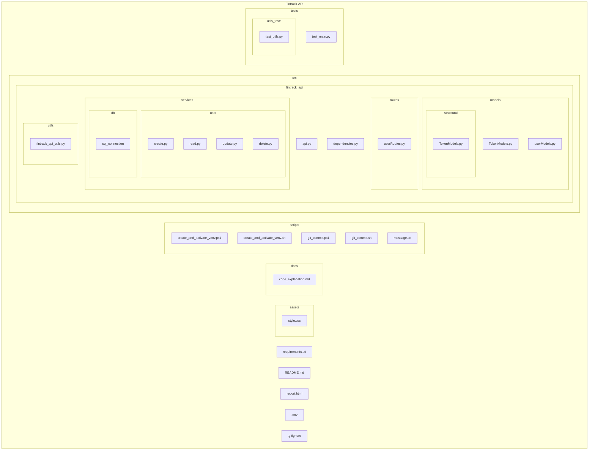

# Fintrack-API

## Overview

**Fintrack-API** is a financial management application designed to help users track their finances effectively. This application is developed as part of the Software Engineering project for **C214**, a course at the National Institute of Telecommunications (**INATEL**). The main goal of this project is to provide a functional API that enables users to manage their financial data, offering operations such as creating, updating, and deleting records.

## Index

1. [Folder Structure](#folder-structure)

2. [Setting up the Environment](#setting-up-the-environment)

    - [Option 1: Manual Setup](#option-1-manual-setup)

    - [Option 2: Using the provided script](#option-2-using-the-provided-script)

3. [Running the Application](#running-the-application)

4. [Contributors](#contributors)

---

## Folder Structure

The project is structured as follows:



---

## Setting up the Environment

To run the **Fintrack-API** project, you will need to create and activate a virtual environment and install the required dependencies. You can set up the environment in two ways:

### Option 1: Manual Setup

1. Create the virtual environment:
    ```bash
    python -m venv C214venv
    ```

2. Activate the virtual environment:
    - For Windows:
        ```bash
        .\C214venv\Scripts\activate
        ```

    - For macOS/Linux:
        ```bash
        source C214venv/bin/activate
         ```

3. Install the dependencies::
    ```bash
    pip install -r requirements.txt
    ```

### Option 2: Using the provided script

You can also create and activate the virtual environment using the provided script:

1. Run the script:
    ```bash
    ./scripts/create_and_activate_venv.sh
    ```

2. Install the dependencies::
    ```bash
    pip install -r requirements.txt
    ```

---

## Running the Application

Once the environment is set up, you can start the application by running the following command:

```bash
python src/main.py
```

This will start the Fintrack-API and allow you to make requests for managing financial records.

---

## Running Tests

There are tests to test this API, to run the test it's necessary to run the following command:

```bash
pytest src/tests/test_main.py
```

> **Remember:** Make sure that the API is running before using the tests.

## Contributors

### [Álvaro Ribeiro](https://github.com/AlvaroLucioRibeiro)

Undergraduate student in the eighth (8th) semester of Software Engineering at the National Institute of Telecommunications (Inatel). Industrial Apprentice in Installation and Repair of Computer Networks at Senai Orlando Chiarini. I have participated in a Scientific Initiation at the Cybersecurity and Internet of Things Laboratory (CS&ILAB) with the project: 'Secure Software Development - Phases 01 and 02.' Currently, I am an intern at the Inatel Competence Center (ICC) in the R&D Software area.

### [Francisco Guimarães](https://github.com/FranciscoPGuimaraes)
Currently, I am completing my degree in Software Engineering at INATEL and working as a Data Science Intern at Embraer.

### [Laura Pivoto](https://github.com/LauraPivoto)

Currently graduating in Software Engineering, researcher in Secure Software development at CS&I Lab. and object-oriented programming monitor at the Instituto Nacional de Telecomunicações. I have experience in IoT, mobile and web development in Android Studio, Thunkable, Flutter, Visual Studio Code and intermediate knowledge in C++, Java and Python.

### [Matheus Fonseca](https://github.com/matheusAFONSECA)

Undergraduate student in the eighth (8th) semester of Computer Engineering at the National Institute of Telecommunications (Inatel). I participated in a Scientific Initiation at the Cybersecurity and Internet of Things Laboratory (CS&ILAB), where, in the Park Here project, I developed skills in computer vision applied to parking systems, focusing on license plate recognition and vehicle identification. Additionally, I served as a teaching assistant for Physics 1, 2, and 3, helping with practical classes, report writing, and answering theoretical questions. Currently, I am an intern at the Inatel Competence Center (ICC) in the PDI SW department.


--- 